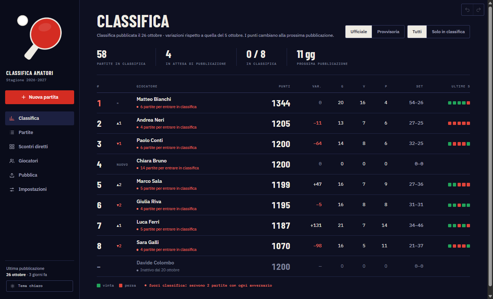
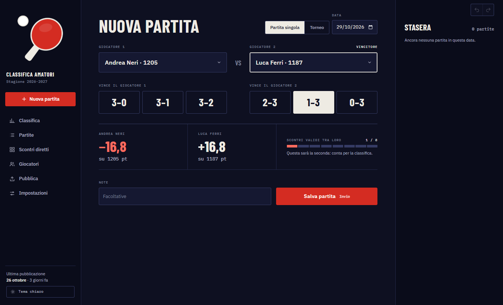
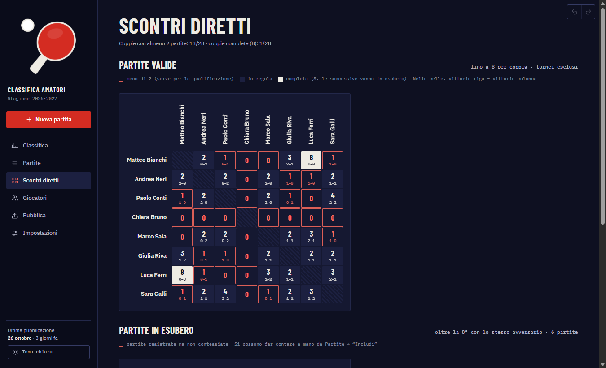
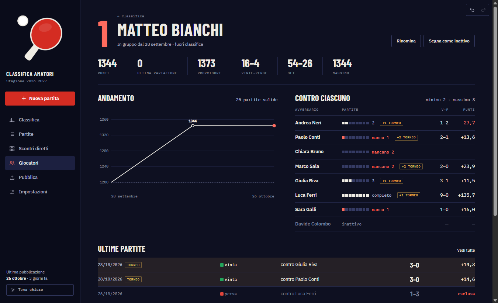
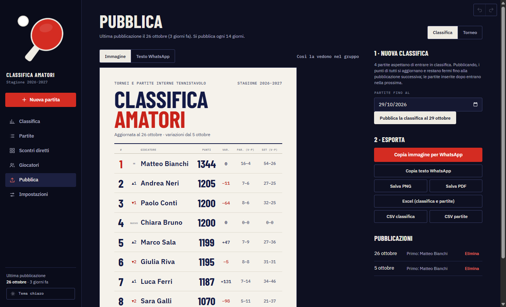
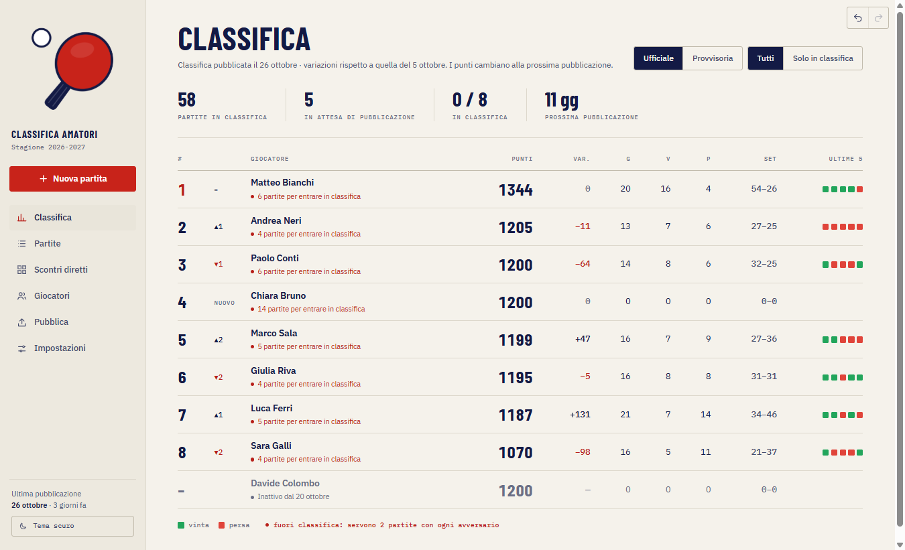
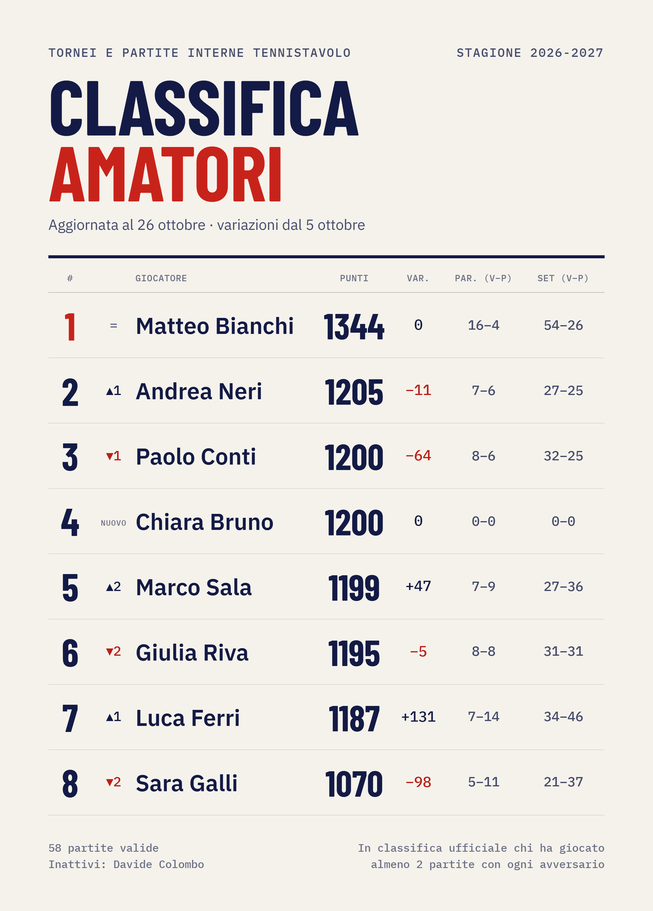

<p align="center">
  
</p>

<h1 align="center">Tornei e partite interne tennistavolo</h1>

<p align="center">
  Classifica Elo e tornei per il gruppo <strong>amatori</strong> di un circolo di tennistavolo.<br>
  App desktop per Windows · Electron + React + TypeScript · sviluppata con Claude Code
</p>

<p align="center">
  
</p>

---

## Cos'è

Un'app nata per un problema reale: in un circolo di tennistavolo, durante la stagione i giocatori del gruppo amatori
si sfidano a fine allenamento in partite ufficiali al meglio dei 5 set, senza un calendario fisso (chi c'è sfida chi
c'è), e ogni tanto organizzano tornei interni. Prima i risultati si tenevano a mano.

L'app registra i risultati, calcola i punti con il sistema **Elo**, gestisce i tornei con gironi e tabellone e applica
automaticamente il regolamento della stagione, così che il responsabile debba solo inserire le partite e pubblicare la
classifica ogni due settimane nel gruppo WhatsApp. È in uso nel circolo dalla stagione 2026-2027.

> Tutti i nomi, i risultati e le immagini in questo repository sono **dati di prova** generati dagli script
> in `scripts/`: nessun dato reale dei giocatori è incluso.

## Come è stato sviluppato

Il progetto è stato sviluppato con **[Claude Code](https://claude.com/claude-code)**, l'assistente di programmazione
di Anthropic, che ha scritto la maggior parte del codice. Il mio lavoro è stato:

- **analisi del problema e requisiti**: raccolta del regolamento del gruppo (limite di partite per coppia, soglia di
  qualificazione, giocatori inattivi, tornei, pubblicazione a periodi come la classifica FITET) e dei casi particolari;
- **decisioni di prodotto e di architettura**: logica di calcolo separata dall'interfaccia (`src/core`, riusabile per
  una futura versione Android), dati in un unico file JSON con backup e sincronizzazione senza server;
- **verifica**: revisione delle modifiche, test d'uso con il responsabile del gruppo, segnalazione e correzione dei
  bug, controllo dei casi limite;
- **rilascio e supporto**: versioni, installer, manuale d'uso per chi usa l'app.

I commit scritti insieme a Claude Code lo riportano nella riga `Co-Authored-By`. La qualità è controllata da
57 test automatici sul motore di calcolo, da un test end-to-end che usa l'app vera e dal controllo dei tipi TypeScript.

## Funzionalità

- **Inserimento rapido delle partite**: due clic per i giocatori, uno per il risultato (3-0, 3-1, 3-2…).
  Prima di salvare mostra quanti punti guadagna e perde ciascuno e avvisa se la partita non conterà.
- **Tornei**: girone unico, girone unico + tabellone, più gironi + tabellone (oppure formato libero). Si crea il torneo
  (data, nome facoltativo, K proprio, predefinito 48), si assegnano i giocatori ai gironi e si inseriscono le partite
  fase per fase, al meglio dei 5 o dei 3 set, con i punteggi dei singoli set facoltativi. Nel girone ogni coppia gioca
  una volta sola; nel tabellone si scelgono a mano gli accoppiamenti del primo turno (anche con la X: chi la prende passa
  il turno) e poi avanza da solo con i vincitori; a gironi finiti l'app compone da sola il primo turno (modificabile).
  Si possono inserire solo le partite in programma, una volta sola. Un torneo si elimina con tutte le sue partite
  (e si elimina da solo quando se ne cancella l'ultima partita). Il
  tabellone può partire da un turno più largo dei qualificati, con finale per il 3º posto opzionale. Le partite di torneo
  sono evidenziate in oro.
- **Classifica** con punti, variazione e ▲▼ di posizione rispetto all'ultima pubblicazione, vittorie,
  sconfitte, set, forma recente e stato di qualificazione.
- **Scontri diretti**: tabella di chi ha giocato con chi, con evidenziate le coppie che non hanno ancora
  raggiunto il minimo richiesto o che hanno già esaurito le partite valide, più una seconda tabella con le
  partite in esubero (oltre l'8ª con lo stesso avversario).
- **Scheda giocatore** con grafico dell'andamento dei punti e bilancio contro ogni avversario.
- **Pubblicazione**: immagine o testo pronti da incollare su WhatsApp, oppure PNG, PDF, Excel e CSV. Per ogni torneo
  anche un riepilogo con podio, partecipanti, gironi, tabellone e risultati set per set.
- **Partite escluse, mai cancellate**: restano visibili barrate con il motivo e si possono includere o
  escludere a mano.
- **Tema scuro** (predefinito) e **tema chiaro**, oppure automatico come Windows. Grafica “da tabellone”: blu e rosso, numeri in Barlow Condensed, testi in IBM Plex Sans e Plex Mono (font inclusi nell'app, funzionano anche offline).
- **Backup automatici**, ripristino con un clic, **Ctrl+Z / Ctrl+Y** (o i pulsanti in alto a destra) per annullare e ripetere.
- **Esporta e importa i dati** (file `.amat`) per spostarli su un altro PC o, in futuro, su Android.

| Nuova partita | Scontri diretti |
| --- | --- |
|  |  |

| Scheda giocatore | Pubblicazione |
| --- | --- |
|  |  |

Tema chiaro:

<p align="center"></p>

Esempio di immagine esportata per il gruppo. Gli export (immagine, PDF, testo WhatsApp, Excel) usano il nome pubblico **Tornei e partite interne tennistavolo** e sono sempre chiari, qualunque sia il tema:

<p align="center"></p>

## Regolamento applicato (stagione 2026-2027)

| Regola | Come la applica l'app |
| --- | --- |
| Tutti partono da **1200 punti**, anche chi entra a stagione in corso | Ogni giocatore parte da 1200 alla sua data di ingresso |
| Sistema **Elo con K = 32** | Probabilità attesa `E = 1 / (1 + 10^((Rb − Ra) / 400))`, variazione `32 × (risultato − E)`. Chi batte un avversario più forte guadagna di più |
| Al massimo **8 partite** con lo stesso avversario | Dalla 9ª in poi la partita viene registrata ma non conta (“esubero”); le partite in esubero hanno una tabella a parte negli scontri diretti |
| Per la classifica ufficiale servono almeno **2 partite con ciascun avversario** | Chi non raggiunge la soglia resta visibile in rosso come “fuori classifica”, con l'elenco delle partite che mancano |
| **Tornei**: K diverso (predefinito **48**) | Ogni torneo ha data, nome facoltativo e K propri; le sue partite (al meglio dei 5 o dei 3) non occupano posti delle 8 per coppia e non valgono per il minimo di 2 |
| **Inattivi**: le partite di chi smette vanno in pausa | Segnando un giocatore come inattivo, tutte le sue partite restano salvate ma non contano per nessuno e i punti di tutti vengono ricalcolati; riattivandolo tornano a contare |
| Casi particolari | Ogni partita può essere forzata a mano come inclusa o esclusa, con un motivo |
| Classifica **pubblicata ogni 2 settimane**, come la FITET | La classifica resta ferma tra una pubblicazione e l'altra. Tutte le partite del periodo si calcolano con i punti della classifica in vigore e le variazioni si sommano quando si pubblica (“Pubblica la classifica”, con un promemoria quando è ora). Una partita inserita dopo la pubblicazione entra nella successiva, anche se giocata prima. Correggere una partita già pubblicata ricalcola anche le classifiche pubblicate. In Classifica, la vista **Provvisoria** mostra come sarebbe pubblicando adesso |

La classifica viene sempre **ricalcolata da zero** ripercorrendo le partite in ordine di data: correggere o
eliminare una partita vecchia, o riattivare un giocatore inattivo, aggiorna tutto in modo coerente.
Tutti i numeri (punti di partenza, K normale e K proposto per i tornei, limite e soglia, giorni tra le pubblicazioni) si cambiano da
**Impostazioni**.

## Installazione

Compilando il progetto (vedi [Sviluppo](#sviluppo)) con `npm run build:win` si ottengono due file in `dist/`:

- `TennistavoloAmatori-Setup-x.y.z.exe`: installer classico con collegamento sul desktop.
- `TennistavoloAmatori-Portable-x.y.z.exe`: si avvia senza installare nulla.

L'eseguibile non è firmato digitalmente: al primo avvio Windows potrebbe mostrare l'avviso
“PC protetto da Windows”. Cliccare **Ulteriori informazioni → Esegui comunque**.

## Dove sono i dati

| Cosa | Percorso |
| --- | --- |
| Dati | `%APPDATA%\Amatori\data.json` |
| Backup automatici (ultime 30 copie) | `%APPDATA%\Amatori\backup\` |

Il file dati è un unico JSON leggibile. Per usare un'altra cartella (es. su chiavetta) impostare la variabile
d'ambiente `AMATORI_DATA_DIR`.

**Sincronizzazione**: “Esporta tutti i dati” crea un file `.amat`; “Importa” lo **unisce** ai dati presenti.
Per ogni giocatore, partita o pubblicazione vince la versione modificata più di recente, le eliminazioni si
propagano e niente viene duplicato.

## Sviluppo

Requisiti: Node.js 22 o superiore.

```bash
npm install
npm run dev          # avvia l'app in modalità sviluppo
npm test             # test del motore di calcolo (Vitest)
npm run typecheck    # controllo dei tipi TypeScript
npm run e2e          # test end-to-end: usa l'app compilata su dati di prova
npm run screenshots  # avvia l'app con dati di prova e salva screenshot ed export in ./snaps
npm run guide        # rigenera il PDF del manuale d'uso (docs/guida)
npm run icon         # rigenera icona e logo da build/logo.svg
npm run build:win    # crea installer e versione portable in ./dist
```

### Struttura

```
src/
  core/        logica pura in TypeScript, senza dipendenze
    types.ts       modello dati
    elo.ts         formula Elo
    rules.ts       limite per coppia, regola abbandoni, esclusioni manuali
    standings.ts   ricalcolo cronologico, statistiche, qualificazione
    mutations.ts   operazioni sui dati
    format.ts      testo WhatsApp e CSV
    sync.ts        formato .amat e unione dei dati
  main/        processo Electron: file, backup, dialoghi, PDF, Excel
  preload/     API esposta all'interfaccia
  renderer/    interfaccia React (pagine, componenti, export PNG/PDF)
tests/         test del motore di calcolo
scripts/       test end-to-end, screenshot automatici, manuale PDF, generazione icona
docs/guida/    manuale d'uso (HTML e PDF)
```

## Verso Android

L'app è predisposta per una futura versione Android:

- tutta la logica di calcolo è in `src/core`, riusabile così com'è;
- l'interfaccia è una normale app web React, impacchettabile con **Capacitor** sostituendo `window.api`
  (oggi fornita da Electron) con un'implementazione basata sul filesystem del telefono;
- lo scambio dati fra desktop e telefono avviene con il file `.amat`, senza bisogno di server.
